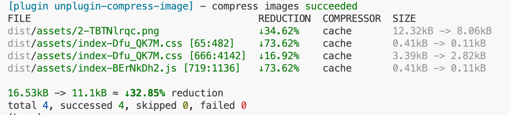

# unplugin-compress-image

[](https://www.npmjs.com/package/unplugin-compress-image)
[](LICENSE)

[中文文档](./README.zh-CN.md) | English

An image compression plugin for build tools like Vite, Webpack, Rollup and more. Supports compressing image assets using jsquash, TinyPNG, and SVGO, with support for custom compressors.

## ✨ Features

- 🏗️ **Multi Build Tool Support**: Supports Vite, Rollup, Webpack (not tested). Future versions will support all build tools supported by unplugin
- 🖼️ **Multi Format Support**: PNG, JPEG, WebP, AVIF, SVG
- 🎯 **Multi Compressor Support**:
  - **jsquash**: Local compression, no network connection required
  - **TinyPNG**: Cloud compression with higher compression ratio
  - **SVGO**: SVG optimization
  - **Custom Compressors**: Support for extending custom compression logic
  - **Auto Selection**: Multiple compressors process simultaneously, automatically keeping the smallest result
- 📦 **Base64 Image Compression**: Automatically compress base64 format images in JS/CSS files
- 💾 **Caching Mechanism**: Avoid duplicate compression, improve build performance
- 📊 **Build Logs**: Display compression results and performance statistics

## 📦 Installation

```bash
# pnpm
pnpm add -D unplugin-compress-image

# npm
npm install -D unplugin-compress-image

# yarn
yarn add -D unplugin-compress-image
```

## 🚀 Usage

### Vite

```typescript
// vite.config.ts
import CompressImage from 'unplugin-compress-image/vite'
import { defineConfig } from 'vite'

export default defineConfig({
  plugins: [
    CompressImage()
  ]
})
```

### Webpack (Not Tested)

```javascript
// webpack.config.js
const CompressImage = require('unplugin-compress-image/webpack')

module.exports = {
  plugins: [
    CompressImage({
      jsquash: {
        mozjpeg: { quality: 80 },
        oxipng: { level: 3 }
      }
    })
  ]
}
```

### Rollup

```javascript
// rollup.config.js
import CompressImage from 'unplugin-compress-image/rollup'

export default {
  plugins: [
    CompressImage({
      jsquash: {
        mozjpeg: { quality: 80 }
      }
    })
  ]
}
```

## ⚙️ Configuration Options

### Basic Configuration

```typescript
interface Options {
  // TinyPNG compressor configuration
  tinypng?: false | TinyPngOptions

  // jsquash compressor configuration
  jsquash?: false | JsquashOptions

  // SVGO compressor configuration
  svgo?: false | SvgoConfig

  // Custom compressors
  compressors?: (Compressor | CompressorFn)[]

  // Cache configuration
  cache?: false | {
    dir?: string // Cache directory, default: '{cwd}/node_modules/.compress-image-cache'
  }

  // Show logs
  logger?: boolean // Default: true

  // Compress base64 images
  base64?: boolean // Default: true
}
```

### TinyPNG Configuration

```typescript
interface TinyPngOptions {
  // API keys (supports multiple keys for rotation)
  // Can also be set via TINYPNG_KEYS environment variable
  keys?: string[]

  // Proxy configuration
  proxy?: string

  // Custom API URL
  url?: string
}
```

**Environment Variable Support**:

TinyPNG API keys support configuration via environment variables to avoid hardcoding sensitive information in code:

```plain
# Single API key
TINYPNG_KEYS="your-api-key"

# Multiple API keys (comma separated)
TINYPNG_KEYS="key1,key2,key3"
```

If both `keys` in the configuration file and environment variables are set, the configuration file settings will take precedence.

### jsquash Configuration

```typescript
interface JsquashOptions {
  // JPEG compression configuration
  // For detailed configuration parameters, refer to: https://github.com/jamsinclair/jSquash/tree/main/packages/mozjpeg
  // Note: Currently uses library default values, custom defaults will be provided in future versions
  mozjpeg?: {}

  // PNG compression configuration
  // For detailed configuration parameters, refer to: https://github.com/jamsinclair/jSquash/tree/main/packages/oxipng
  // Note: Currently uses library default values, custom defaults will be provided in future versions
  oxipng?: {}

  // WebP compression configuration
  // For detailed configuration parameters, refer to: https://github.com/jamsinclair/jSquash/tree/main/packages/webp
  // Note: Currently uses library default values, custom defaults will be provided in future versions
  webp?: {}

  // AVIF compression configuration
  // For detailed configuration parameters, refer to: https://github.com/jamsinclair/jSquash/tree/main/packages/avif
  // Note: Currently uses library default values, custom defaults will be provided in future versions
  avif?: {}
}
```

### SVGO Configuration

```typescript
interface SvgoConfig {
  plugins?: string[] | object[]
  js2svg?: object
  // For detailed configuration parameters, refer to: https://github.com/svg/svgo
  // Note: Currently uses library default values, custom defaults will be provided in future versions
}
```

## 🔧 Custom Compressors

You can use `defineCompressor` to create custom compressors:

```typescript
import { defineCompressor } from 'unplugin-compress-image/define'

const customCompressor = defineCompressor('custom', () => ({
  use: (fileType) => {
    // Define supported file types
    return fileType.ext === 'png'
  },

  compress: async (buffer, fileType) => {
    // Implement compression logic
    // Return compressed buffer
    return compressedBuffer
  }
}))

// Use in configuration
export default defineConfig({
  plugins: [
    CompressImage({
      compressors: [customCompressor]
    })
  ]
})
```

## 📋 Usage Examples

### Local Compression Only

```typescript
CompressImage({
  jsquash: {
    mozjpeg: { quality: 85 },
    oxipng: { level: 3 },
    webp: { quality: 85 }
  },
  tinypng: false
})
```

### TinyPNG Only

```typescript
CompressImage({
  tinypng: {
    keys: ['your-api-key-1', 'your-api-key-2']
  },
  jsquash: false
})
```

### Using Environment Variables for TinyPNG

```typescript
// After setting environment variables, keys configuration can be omitted
// export TINYPNG_KEYS="your-api-key"
// or export TINYPNG_KEYS="key1,key2,key3"
CompressImage({
  tinypng: true, // Read API keys from environment variables
  jsquash: false
})
```

### Mixed Multiple Compressors

```typescript
CompressImage({
  // PNG/JPEG using TinyPNG
  tinypng: {
    keys: ['your-api-key']
  },
  // WebP/AVIF using jsquash
  jsquash: {
    webp: { quality: 80 },
    avif: { quality: 70 }
  },
  // SVG using SVGO
  svgo: {
    plugins: ['preset-default']
  }
})
```

## 📊 Compression Results

The plugin displays compression statistics after build completion:



## 🔗 Related Links

- [jsquash](https://github.com/jamsinclair/jSquash) - WebAssembly image compression
- [TinyPNG](https://tinypng.com/developers/reference/nodejs) - PNG and JPEG compression
- [SVGO](https://github.com/svg/svgo) - SVG optimization

## 📄 License

[MIT](LICENSE) License © 2025 [pzehrel](https://github.com/pzehrel)
