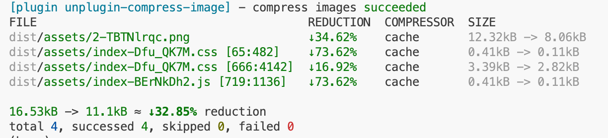

# unplugin-compress-image

[](https://www.npmjs.com/package/unplugin-compress-image)
[](LICENSE)

中文文档 | [English](./README.md)

一个用于 Vite、Webpack、Rollup 等构建工具的图片压缩插件。支持使用 jsquash、TinyPNG 和 SVGO 压缩图片资源，支持自定义压缩器。

## ✨ 特性

- 🏗️ **多构建工具支持**: 支持 Vite、Rollup，Webpack（未经测试）。未来版本将支持 unplugin 支持的所有构建工具
- 🖼️ **多格式支持**: PNG、JPEG、WebP、AVIF、SVG
- 🎯 **多压缩器支持**:
  - **jsquash**: 本地压缩，无需网络连接
  - **TinyPNG**: 云端压缩，压缩比率较高
  - **SVGO**: SVG 优化
  - **自定义压缩器**: 支持扩展自定义压缩逻辑
  - **自动选择**: 多个压缩器同时处理，自动保留体积最小的结果
- 📦 **Base64 图片压缩**: 自动压缩 JS/CSS 文件中的 base64 格式图片
- 💾 **缓存机制**: 避免重复压缩，提升构建性能
- 📊 **构建日志**: 显示压缩结果和性能统计

## 📦 安装

```bash
# pnpm
pnpm add -D unplugin-compress-image

# npm
npm install -D unplugin-compress-image

# yarn
yarn add -D unplugin-compress-image
```

## 🚀 使用方法

### Vite

```typescript
// vite.config.ts
import CompressImage from 'unplugin-compress-image/vite'
import { defineConfig } from 'vite'

export default defineConfig({
  plugins: [
    CompressImage()
  ]
})
```

### Webpack（未经测试）

```javascript
// webpack.config.js
const CompressImage = require('unplugin-compress-image/webpack')

module.exports = {
  plugins: [
    CompressImage({
      jsquash: {
        mozjpeg: { quality: 80 },
        oxipng: { level: 3 }
      }
    })
  ]
}
```

### Rollup

```javascript
// rollup.config.js
import CompressImage from 'unplugin-compress-image/rollup'

export default {
  plugins: [
    CompressImage({
      jsquash: {
        mozjpeg: { quality: 80 }
      }
    })
  ]
}
```

## ⚙️ 配置选项

### 基础配置

```typescript
interface Options {
  // TinyPNG 压缩器配置
  tinypng?: false | TinyPngOptions

  // jsquash 压缩器配置
  jsquash?: false | JsquashOptions

  // SVGO 压缩器配置
  svgo?: false | SvgoConfig

  // 自定义压缩器
  compressors?: (Compressor | CompressorFn)[]

  // 缓存配置
  cache?: false | {
    dir?: string // 缓存目录，默认: '{cwd}/node_modules/.compress-image-cache'
  }

  // 显示日志
  logger?: boolean // 默认: true

  // 压缩 base64 图片
  base64?: boolean // 默认: true
}
```

### TinyPNG 配置

```typescript
interface TinyPngOptions {
  // API keys (支持多个 key 轮换使用)
  // 也可以通过环境变量 TINYPNG_KEYS 设置
  keys?: string[]

  // 代理配置
  proxy?: string

  // 自定义 API URL
  url?: string
}
```

**环境变量支持**：

TinyPNG API keys 支持通过环境变量文件配置，可以避免在代码中硬编码敏感信息：

```plain
# 单个 API key
TINYPNG_KEYS="your-api-key"

# 多个 API keys (用逗号分隔)
TINYPNG_KEYS="key1,key2,key3"
```

如果同时设置了配置文件中的 `keys` 和环境变量，将优先使用配置文件中的设置。

### jsquash 配置

```typescript
interface JsquashOptions {
  // JPEG 压缩配置
  // 详细配置参数请参考: https://github.com/jamsinclair/jSquash/tree/main/packages/mozjpeg
  // 注意: 目前使用库自带的默认值，未来版本将提供自定义默认值
  mozjpeg?: {}

  // PNG 压缩配置
  // 详细配置参数请参考: https://github.com/jamsinclair/jSquash/tree/main/packages/oxipng
  // 注意: 目前使用库自带的默认值，未来版本将提供自定义默认值
  oxipng?: {}

  // WebP 压缩配置
  // 详细配置参数请参考: https://github.com/jamsinclair/jSquash/tree/main/packages/webp
  // 注意: 目前使用库自带的默认值，未来版本将提供自定义默认值
  webp?: {}

  // AVIF 压缩配置
  // 详细配置参数请参考: https://github.com/jamsinclair/jSquash/tree/main/packages/avif
  // 注意: 目前使用库自带的默认值，未来版本将提供自定义默认值
  avif?: {}
}
```

### SVGO 配置

```typescript
interface SvgoConfig {
  plugins?: string[] | object[]
  js2svg?: object
  // 详细配置参数请参考: https://github.com/svg/svgo
  // 注意: 目前使用库自带的默认值，未来版本将提供自定义默认值
}
```

## 🔧 自定义压缩器

你可以使用 `defineCompressor` 创建自定义压缩器：

```typescript
import { defineCompressor } from 'unplugin-compress-image/define'

const customCompressor = defineCompressor('custom', () => ({
  use: (fileType) => {
    // 定义支持的文件类型
    return fileType.ext === 'png'
  },

  compress: async (buffer, fileType) => {
    // 实现压缩逻辑
    // 返回压缩后的 buffer
    return compressedBuffer
  }
}))

// 在配置中使用
export default defineConfig({
  plugins: [
    CompressImage({
      compressors: [customCompressor]
    })
  ]
})
```

## 📋 使用示例

### 仅启用本地压缩

```typescript
CompressImage({
  jsquash: {
    mozjpeg: { quality: 85 },
    oxipng: { level: 3 },
    webp: { quality: 85 }
  },
  tinypng: false
})
```

### 仅启用 TinyPNG

```typescript
CompressImage({
  tinypng: {
    keys: ['your-api-key-1', 'your-api-key-2']
  },
  jsquash: false
})
```

### 使用环境变量配置 TinyPNG

```typescript
// 设置环境变量后，可以省略 keys 配置
// export TINYPNG_KEYS="your-api-key"
// 或者 export TINYPNG_KEYS="key1,key2,key3"
CompressImage({
  tinypng: true, // 从环境变量读取 API keys
  jsquash: false
})
```

### 混合使用多种压缩器

```typescript
CompressImage({
  // PNG/JPEG 使用 TinyPNG
  tinypng: {
    keys: ['your-api-key']
  },
  // WebP/AVIF 使用 jsquash
  jsquash: {
    webp: { quality: 80 },
    avif: { quality: 70 }
  },
  // SVG 使用 SVGO
  svgo: {
    plugins: ['preset-default']
  }
})
```

## 📊 压缩效果

插件在构建完成后会显示压缩统计信息：



## 🔗 相关链接

- [jsquash](https://github.com/jamsinclair/jSquash) - WebAssembly image compression
- [TinyPNG](https://tinypng.com/developers/reference/nodejs) - PNG and JPEG compression
- [SVGO](https://github.com/svg/svgo) - SVG optimization

## 📄 License

[MIT](LICENSE) License © 2025 [pzehrel](https://github.com/pzehrel)
